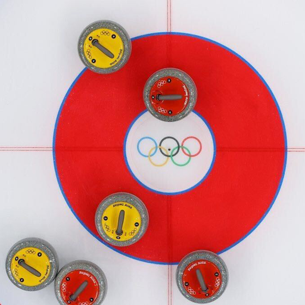
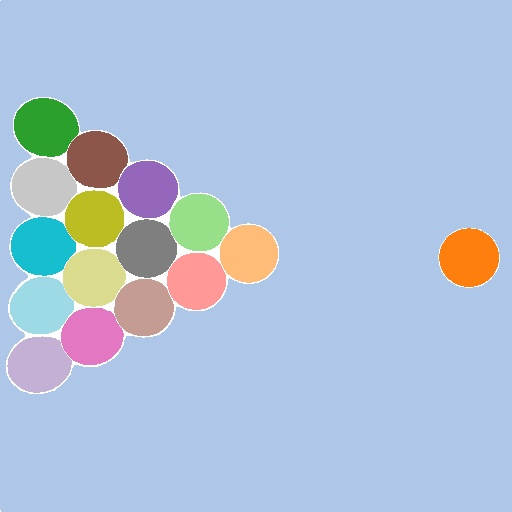
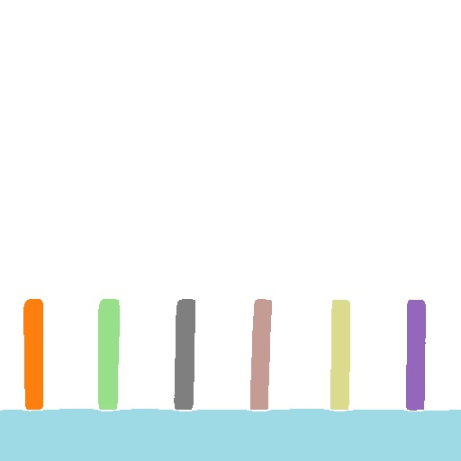
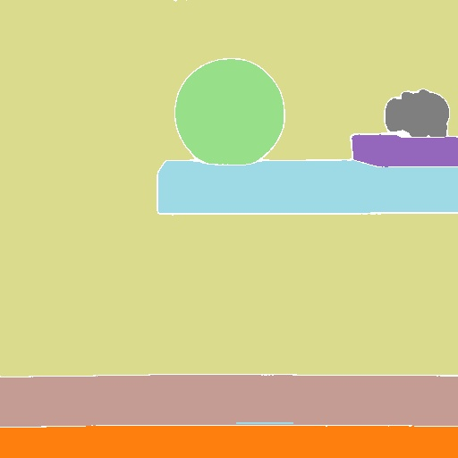
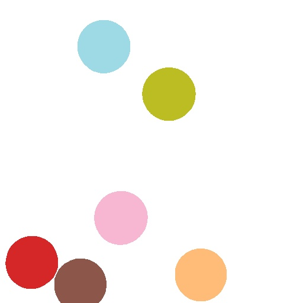
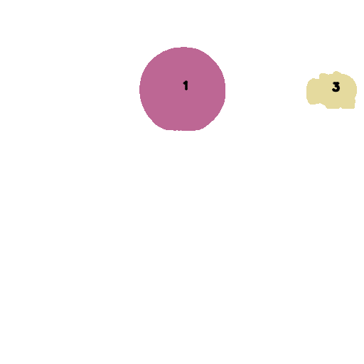
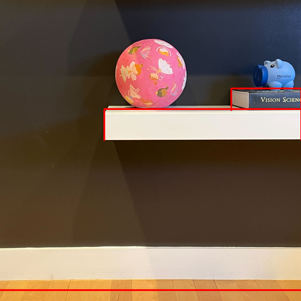

# Perception

## Segmentation

### GPT-based Recognize Anything 
- We use GPT-4V to recognize objects in the image as input prompt for [Grounded-Segment-Anything](https://github.com/IDEA-Research/Grounded-Segment-Anything). Alternatively, you could use any other object recognition model (e.g. [RAM](https://github.com/xinyu1205/recognize-anything)) to get the objects in the given image.

- We put pre-computed GPT-4V result under each `data/${name}/obj_movable.json`. You could skip below and run [segmentation](#grounded-segment-anything) if you don't want to re-run GPT-4V.

- Copy the OpenAI API key into `gpt/gpt_configs/my_apikey`.

- Install requirements
    ```bash
    pip install inflect openai==0.28
    ```
- Run GPT-4V based RAM
    ```Shell
    python gpt_ram.py --img_path ../data/${name}
    ```
- The default `save_path` is saved under same folder as input `../data/${name}/intermediate/obj_movable.json`. The output is a list in json format.

    ```shell
    [
       {"obj_1": True # True if the object is movable or False if not},
       {"obj_2": True},
         ...
    ]
    ```

### Grounded-Segment-Anything
We use [Grounded-Segment-Anything](https://github.com/IDEA-Research/Grounded-Segment-Anything/tree/753dd6675ea7935af401a983e88d159629ad4d5b) to segment the input image given the prompts input. We use the earlier checkout version for the paper. You could adapt the code to the latest version of [Grounded-SAM](https://github.com/IDEA-Research/Grounded-Segment-Anything) or [Grounded-SAM-2](https://github.com/IDEA-Research/Grounded-SAM-2). 

- Follow the [Grounded-SAM setup](https://github.com/IDEA-Research/Grounded-Segment-Anything/tree/753dd6675ea7935af401a983e88d159629ad4d5b?tab=readme-ov-file#install-without-docker)
    ```Shell
    cd Grounded-Segment-Anything/
    git checkout 753dd6675ea7935af401a983e88d159629ad4d5b
    
    # Follow Grounded-SAM readme to install requirements
    
    # Download pretrained weights to current folder
    wget https://dl.fbaipublicfiles.com/segment_anything/sam_vit_h_4b8939.pth
    wget https://github.com/IDEA-Research/GroundingDINO/releases/download/v0.1.0-alpha/groundingdino_swint_ogc.pth

    ```
- Segmentation requires the input image `input` and a prompt `prompts_path` for each object in the image. The default prompt path is `../data/${name}/intermediate/obj_movable.json`.

    ```Shell
    python run_gsam.py --input ../data/${name}
    ```
- The default `output` is saved under the same folder as input `../data/${name}` and visualizations under `../data/${name}/intermediate` as follows:
    ```Shell
    image folder/  
        ├── intermediate/
            ├── mask.png # FG and BG segmentation mask
            ├── mask.json # segmentation id and and object name, movability
            ├── vis_mask.jpg # segmentation visualization
    ```
    | **Pool** | **Domino** | **Pig Ball** | **Balls**  
    |:---------:|:----------------:|:----------:| :----------:|
    |  |  | |  |
    |  |  | |  |


## Depth and Normal Estimation
- We use [GeoWizard](https://github.com/fuxiao0719/GeoWizard) to estimate depth and normal of input image. Follow [GeoWizard setup](https://github.com/fuxiao0719/GeoWizard/blob/main/README.md#%EF%B8%8F-setup) to install requirements. Recommend to create a new conda environment.

- Run GeoWizard on input image
    ```Shell
    python run_depth_normal.py --input ../data/${name} --output ../outputs/${name} --vis
    ```
- Depth and normal are saved in `outputs/${name}`. Visualizations are saved in `outputs/${name}/intermediate`.
    ```Shell
    image folder/ 
        ├──depth.npy
        ├── normal.npy
        ├── intermediate/
            ├── depth_vis.png
            ├── normal_vis.png
    ```

    | **Input** | **Normal** | **Depth** 
    |:---------:|:----------------:|:----------:|
    |  |  |  |


## Foreground / Background & Edge Detection
- We separate the foreground and background using the segmentation mask. Foreground objects with complete masks are used for physics reasoning and simulation, while truncated objects are treated as static. We use edges from static objects and the background as physical boundaries for simulation. 
- Module requires the following input for each image:
    ```Shell
    image folder/ 
        ├── depth.npy
        ├──normal.npy
        ├── original.png # optional:for visualization only
        ├── intermediate/
            ├── mask.png # complete image segmentation mask
            ├── mask.json # segmentation id and and object name, movability
    ```
- Run foreground/background separation and edge detection
    ```Shell
    python run_fg_bg.py --input ../data/${name} --vis_edge
    ```
- The default output is saved under the same folder as input `../data/${name}`, contains the final foreground objects mask `mask.png` and edge list `edges.json` saved in `outputs/${name}`. 
    ```Shell
    image folder/ 
        ├── mask.png # final mask
        ├── edges.json
        ├── intermediate/
            ├── edge_vis.png # red line for edges
            ├── fg_mask_vis.png # text is the segmentation id
            ├── bg_mask_vis.png
            ├── bg_mask.png
    ```

    | **Input** | **Foreground** | **Background** | **Edges**  
    |:---------:|:----------------:|:----------:| :----------:|
    |  |  |  |  |
 - We could simulate all foreground objects by specifying their velocity and acceleration use the segmentation id in simulation.


## Inpainting
We use [Inpaint-Anything](https://github.com/geekyutao/Inpaint-Anything) to inpaint the background of input image. You could adapt the code to any other latest inpainting model.

- Follow [Inpaint-Anything setup](https://github.com/geekyutao/Inpaint-Anything?tab=readme-ov-file#installation) to install requirements and download the [pretrained model](https://drive.google.com/drive/folders/1wpY-upCo4GIW4wVPnlMh_ym779lLIG2A). Recommend to create a new conda environment.

    ```Shell
        python -m pip install torch torchvision torchaudio
        python -m pip install -e segment_anything
        python -m pip install -r lama/requirements.txt 
        # Download pretrained model under Inpaint-Anything/pretrained_models/
    ```

- Inpainting requires the input image `../data/${name}/original.png` and a foreground mask of `../data/${name}/mask.png` under the same folder.
    ```Shell
    python run_inpaint.py --input ../data/${name} --output ../outputs/${name} --dilate_kernel_size 20
    ```
    `dilate_kernel_size` could be adjusted in the above script. For heavy shadow image, increase `dilate_kernel_size` to get better inpainting results.

- The output `inpaint.png` is saved in `outputs/${name}`.

    | **Input** | **Inpainting** 
    |:---------:|:----------------:|
    |  |  |


## Physics Reasoning

- Install requirements
    ```bash
    pip install openai==0.28 ruamel.yaml
    ```
- Copy the OpenAI API key into `gpt/gpt_configs/my_apikey`.

- Physics reasoning requires the following input for each image:
     ```Shell
    image folder/ 
        ├── original.png
        ├── mask.png  # movable segmentation mask
    ```
- Run GPT-4V physical property reasoning by the following command:
    ```Shell
    python gpt_physic.py --input ../data/${name} --output ../outputs/${name}
    ```

- The output `physics.yaml` contains the physical properties and primitive shape of each object segment in the image. Note GPT-4V outputs may vary for different runs and differ from the original setting in `data/${name}/sim.yaml`. Users could adjust accordingly to each run output.


## Albedo and Shading Estimation
- We use [Intrinsic](https://github.com/compphoto/Intrinsic/tree/d9741e99b2997e679c4055e7e1f773498b791288) to infer albedo and shading of input image. Follow [Intrinsic setup](https://github.com/compphoto/Intrinsic/tree/d9741e99b2997e679c4055e7e1f773498b791288?tab=readme-ov-file#setup) to install requirements. Recommend to create a new conda environment.
    ```
    git clone https://github.com/compphoto/Intrinsic
    cd Intrinsic/
    git checkout d9741e99b2997e679c4055e7e1f773498b791288
    pip install .
    ```

- Run Intrinsic decomposition on input image
    ```Shell
    python run_albedo_shading.py --input ../data/${name} --output ../outputs/${name} --vis
    ```

- `shading.npy` are saved in `outputs/${name}`. Visualization of albedo and shading are saved in `outputs/${name}/intermediate`.

    | **Input** | **Albedo** | **Shading** 
    |:---------:|:----------------:|:----------:|
    |  |  |  |

- [Intrinsic](https://github.com/compphoto/Intrinsic) has released updated trained model with better results. Feel free to use the updated model or any other model for better performance.
